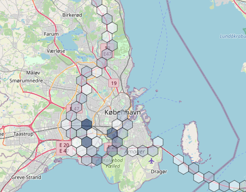

# Track Map - Grafana Panel Plugin

A map plugin to visualise coordinates as markers, hexbin, ant path, or heatmap.

## Earlier versions

This is a new version of the Track Map plugin - now built with React, which works with Grafana 7+.

Note that this plugin is [not backwards compatible](https://grafana.com/docs/grafana/latest/developers/plugins/migration-guide/#compatibility-between-grafana-versions) with the old Grafana 6 versions.

For Grafana 6 and older, please use our [1.x branch](https://github.com/alexandrainst/alexandra-trackmap-panel/releases/tag/1.2.4) instead.

## How to use

### Query

The queries in Grafana can be formatted as `Table` or `Time series` and contain the fields `latitude` and `longitude` or just `lat` and `lon`. To add intensity to the heatmap (instead of using only coordinates), the `intensity` field should be added.

To add a text popup to the markers, a `popup`, `text` or `desc` field should be added. If no popup field exists, latitude and longitude are displayed in the popup.


To add a mouseover tooltip to the markers, add a `tooltip` field. The tooltips can be shown permanently by toggling the `Always show tooltips` option (may require map reload).


Data query example (TimescaleDB with PostGIS):

```SQL
SELECT
avg("lat") as "latitude",  
avg("long") as "longitude",  
max(abs("rssi")) as "intensity",
max("rssi") as "tooltip",
clusters
FROM (SELECT lat,
long,
geo,
rssi,
ST_ClusterKMeans(geo, 100) over() as clusters
FROM table_name) table_name_clustered
GROUP BY clusters
ORDER BY clusters;
```

### Multiple queries at once
It is possible to add multiple data queries to the same map, but these must all be either `Table` or `Time series`, not a mix of the two.

### Configuration

The panel has general configuration options as well as options specific to each visualisation type.

Map center and zoom can be changed with the `Map center latitude`, `Map center longitude` and `Zoom` properties.

Centering the map on the first/last position or zooming to fit all data within the map bounds on load can be achieved by using the `Map center to first position`, `Map center to last position` and `Zoom map to fit data bounds` switches.

To update query variables when the map bounds are updated turn on `Use map bounds in query`. See section "Updating query based on map bounds" below.

Switch between views (Markers, Ant Path, Ant Path With Markers, Hexbin, Heatmap) by selecting a `Visualisation type` .

Note that some options are disabled when others are enabled - e.g. you cannot set a specific zoom level and also zoom the map to fit all data at the same time.

#### Markers

- `Size`: The size of the markers
- `Size of last marker`: The size of the last marker
- `Show only last marker`: Shows only last marker
- `Use secondary icon for last marker`: Uses secondary icon image for last marker
- `Use secondary icon for all markers`: Uses secondary icon image for all markers
- `Always show tooltips`: Always show the mouseover tooltips
- `Use HTML for markers`: Insert custom HTML/SVG for icons
- `Custom icon width`: Use to scale custom icon. Leave empty if custom HTML/SVG has inline size.
- `Custom icon height`: Use to scale custom icon. Leave empty if custom HTML/SVG has inline size.


#### Ant Path

- `Delay`: The delay of the animation
- `Weight`: The width of the path
- `Color`: The color of the path
- `Pulse color`: The color of the pulse running along the path
- `Paused`: Pause/start the animation
- `Reverse`: Reverse the animation direction
- `Hardware Acceleration`: Use/do not use hardware acceleration with the animation


#### Ant Path With Markers

- `Delay`: The delay of the animation
- `Weight`: The width of the path
- `Color`: The color of the path
- `Pulse color`: The color of the pulse running along the path
- `Paused`: Pause/start the animation
- `Reverse`: Reverse the animation direction
- `Hardware Acceleration`: Use/do not use hardware acceleration with the animation
- `Show only last marker`: Shows only last marker
- `Use secondary icon for last marker`: Uses secondary icon image for last marker
- `Use secondary icon for all markers`: Uses secondary icon image for all markers
- `Always show tooltips`: Always show the mouseover tooltips
- `Use HTML for markers`: Insert custom HTML/SVG for icons
- `Custom icon width`: Use to scale custom icon. Leave empty if custom HTML/SVG has inline size.
- `Custom icon height`: Use to scale custom icon. Leave empty if custom HTML/SVG has inline size.


#### Hexbin

- `Opacity`: The opacity of the hexagons
- `Color range from (hex)`: Color ranges from this value
- `Color range to (hex)`: Color ranges to this value
- `Radius range from`: Min radius
- `Radius range to`: Max radius



#### Heatmap

- `Maximum intensity`: Value of intensity that is considered the maximum achievable. Set to 0 to compute the value automatically


#### Hover Marker

- `Color`: Color to display the hover marker outline in
- `Fill color`: Color to use to fill the hover marker
- `Fill opacity`: The opacity of the fill color
- `Weight`: Width of the outline
- `Radius`: Radius of the marker

### Changing marker icons or using custom HTML/SVG icons

There are two ways to change the marker icons. To change the images used, replace the `marker.png` and `marker_secondary.png` files in the `/src/img` folder. To use custom HTML or SVG for icons, toggle the `Use HTML for markers` option and paste the HTML/SVG in the `Default marker HTML` field. The custom icon is surrounded by a div. The size of this div can be set with `Custom icon width` and `Custom icon height`. If left empty, the sizes should be defined in the custom HTML/SVG.

Example (small yellow square with inline height/width):
```
Use HTML for markers: True
Default marker HTML: <div style="background:yellow; width:10px; height:10px;"></div>
Custom icon height: Empty (no value)
Custom icon width: Empty (no value)
```

Example (custom image with set size):
```
Use HTML for markers: True
Default marker HTML: 
Custom icon height: 50
Custom icon width: 25
```

If a timeseries has a label with the key entered in `Override label` and the label value matches a key set in `Marker HTML overrides by label`, then the HTML will be overriden by the defined HTML in the marker override. For multiple series, add multiple `Marker HTML overrides by label`.

Example:
```
Timeseries label is: {"icon": "a"}
Override label: "icon"
Marker HTML overrides by label: key="a", value="<div>custom HTML</div>"
```


### Change ant path colors with labels
In the ant path options, if a timeseries has a label with the key entered in `Override label` and the label value matches a key set in `Color overrides by label`, then the selected color will be used for the ant path. For multiple series, add multiple `Color overrides by label`.

Example:
```
Timeseries label is: {"antCol": "a"}
Override label: "antCol"
Color overrides by label: key="a", value=[color selected in the GUI]
```


### Icon, popup, and tooltip offset
Change the offset values `Icon offset`, `Popup offset`, and `Tooltip offset` to override the default placement of marker icons, popups, and tooltips. The format should be x,y - e.g. `0,50`.


### Changing map style (map tiles)

The tiles that are loaded and displayed within the map can be changed via the "Custom map tiles URL schema" configuration.  
This allows customization of the style to be used for the map (e.g. streets, satellite or dark):


To make use of this configuration, specify a Tile Server URL (see [schema](https://leafletjs.com/reference.html#tilelayer-url-template)) in the input field.
On the OpenStreetMap Wiki there is a list of [publicly available tile servers](https://wiki.openstreetmap.org/wiki/Tile_servers).

#### Mapbox

One of the options is to use the [Static Tile API](https://docs.mapbox.com/api/maps/static-tiles/) provided by Mapbox, which provides a variety of styles (and also allows you to create your own).

You can use some [public example styles](https://docs.mapbox.com/api/maps/styles/#mapbox-styles) with the following URL schemes (the [API key](https://docs.mapbox.com/help/getting-started/access-tokens/) has to be exchanged accordingly):

* [*Streets (v11)*](https://studio.mapbox.com/styles/mapbox/streets-v11/):  
    `https://api.mapbox.com/styles/v1/mapbox/streets-v11/tiles/256/{z}/{x}/{y}?access_token=[YOUR API TOKEN]`
* [*Satellite (v9)*](https://studio.mapbox.com/styles/mapbox/satellite-v9/):  
    `https://api.mapbox.com/styles/v1/mapbox/satellite-v9/tiles/256/{z}/{x}/{y}?access_token=[YOUR API TOKEN]`
* [*Satellite Streets (v11)*](https://studio.mapbox.com/styles/mapbox/satellite-streets-v11/):  
    `https://api.mapbox.com/styles/v1/mapbox/satellite-streets-v11/tiles/256/{z}/{x}/{y}?access_token=[YOUR API TOKEN]`
* [*Dark (v10)*](https://studio.mapbox.com/styles/mapbox/dark-v10/):  
    `https://api.mapbox.com/styles/v1/mapbox/dark-v10/tiles/256/{z}/{x}/{y}?access_token=[YOUR API TOKEN]`

### Updating query based on map bounds

To update the query dynamically based on the map bounds turn on `Use map bounds in query`. To use this you must manually add four variables to the dashboard (via settings in the top right corner). Add four variables of type `constant` with names `minLat`, `minLon`, `maxLat`, and `maxLon`. The values can be anything, e.g. 1, 2, 3, 4 - they will be overwritten by the plugin. Remember to save the dashboard. The variables can then be used in a query. Here is an example that limits the query to the bounds of the map:

```SQL
SELECT
  avg("lat") as "latitude",
  avg("long") as "longitude",
  max(abs("rssi")) as "intensity",
  max("rssi") as "tooltip",
FROM (
  SELECT sys_time, lat, long, geo, rssi, ST_ClusterKMeans(geo, 15) over() as clusters from table_name
  Where lat >= $minLat
    AND lat <= $maxLat
    AND long >= $minLon
    AND long <= $maxLon
) table_name_clustered
GROUP BY clusters
```

## Installation

If you are running Grafana locally, you can clone or download the repository directly into the plugin directory, reset the Grafana server, and the plugin should get detected automatically.

If you are using Docker, a guide can be [found here](https://grafana.com/docs/grafana/latest/installation/docker/#install-plugins-from-other-sources), for instance using the ZIP file as so:

`-e "GF_INSTALL_PLUGINS=https://github.com/alexandrainst/alexandra-trackmap-panel/archive/refs/heads/master.zip" \`

Another example of installing the plug-in in Docker (Replace `grafana_image_name` with your own image name).
```sh
sudo docker exec -it -u root grafana_image_name sh
# Add git and npm inside docker image
apk add git
# Enter plugins folder
cd /var/lib/grafana/plugins/
# Download the source code
git clone https://github.com/alexandrainst/alexandra-trackmap-panel.git
# Exit the docker image
exit
# Restart the grafana docker image
sudo docker restart grafana_image_name
```

For more information on Grafana plugins [look here](https://grafana.com/docs/grafana/latest/plugins/).

## Development

To compile the plugin you need `npm`.

### 1. Install dependencies

```sh
npm install
```

### 2. Build plugin in development & watch mode

```sh
npm run dev
```

### 3. Build plugin in production mode

```sh
npm run build
```

### 4. (optional) Update plugin scaffolding

```sh
npx @grafana/create-plugin@latest update
```

## License

[MIT © Alexandra Institute.](./LICENSE)
